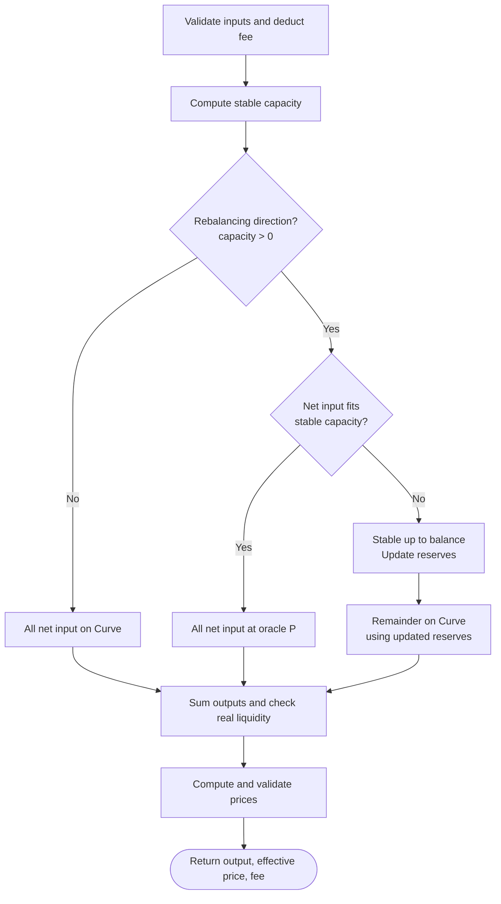

# Part 1 - Pricing Model

[Project README](../README.md) / [Implementation](pricing.py) / [Results](results.md)

## Quote flow

The branches show the three execution cases; the implementation expresses them
with `stable_in = min(net_in, capacity)` and zero output for a zero-input phase.



Invalid inputs, insufficient real liquidity, or invalid computed values reject the quote.

## Pricing equations

| Symbol | Meaning | Unit |
|---|---|---|
| $x,y$ | Real reserves before the swap | Token X, token Y |
| $x_s,y_s$ | Real reserves after the stable phase | Token X, token Y |
| $x_t,y_t$ | Real reserves at a point during the curve phase | Token X, token Y |
| $v_x,v_y$ | Virtual reserves, fixed during the curve phase | Token X, token Y |
| $X,Y$ | Effective reserves at the start of the curve phase | Token X, token Y |
| $\alpha$ | Concentration factor | Dimensionless |
| $P$ | Oracle price | Y per X |
| $p_c$ | Curve-implied marginal price before the swap | Y per X |
| $a$ | Gross input (`amount_in`) | Input token |
| $b$ | Fee rate (`fee_bps`) | Basis points |
| $f$ | Fee charged (`fee_charged`) | Input token |
| $q$ | Input available for pricing after deducting fees (`net_in`) | Input token |
| $c$ | Maximum input executable at oracle $P$ before reaching balance (`capacity`); zero if the direction does not improve balance | Input token |
| $s,r$ | Stable input, remaining curve input | Input token |
| $o_s,o_c,o$ | Stable output, curve output, total output | Output token |
| $L^2$ | Curve invariant | Token X $\times$ token Y |

For X to Y, input is token X and output is token Y; the reverse swap exchanges these units.

**Input allocation**

$$
f=a\frac{b}{10^4},\qquad q=a-f,\qquad s=\min(q,c),\qquad r=q-s.
$$

These equations cover all three paths in the flowchart:

| Execution path | Condition | Stable input $s$ | Curve input $r$ |
|---|---|---|---|
| Curve only | $c=0$ | $0$ | $q$ |
| Stable only | $0<q\le c$ | $q$ | $0$ |
| Stable then Curve | $q>c>0$ | $c$ | $q-c$ |

For Curve only, $o_s=0$ and the curve uses the original reserves ($x_s=x$, $y_s=y$).
For Stable only, $o_c=0$. For the mixed path, the curve uses reserves updated by
the stable phase. All paths return total output $o=o_s+o_c$.

`net_in` comes from the trader's input and fee; `capacity` comes from the pool's
reserves, oracle price, and trade direction. For example, in case E with zero fees,
`net_in = 20,000` USDT and `capacity = 12,620` USDT: 12,620 goes to Stable and
the remaining 7,380 goes to Curve.

**Curve construction after the stable phase**

$$
v_x=(\alpha-1)x_s,\quad v_y=(\alpha-1)y_s,\qquad
X=x_s+v_x=\alpha x_s,\quad Y=y_s+v_y=\alpha y_s.
$$

$$
(x_t+v_x)(y_t+v_y)=L^2=XY,\qquad o=o_s+o_c.
$$

**Outputs and effective price**

| Quantity | X to Y | Y to X |
|---|---|---|
| Stable capacity $c$ | $\max\left(0,\frac{y-Px}{2P}\right)$ | $\max\left(0,\frac{Px-y}{2}\right)$ |
| Stable output $o_s$ | $sP$ | $s/P$ |
| Curve output $o_c$ | $\frac{Yr}{X+r}$ | $\frac{Xr}{Y+r}$ |
| All-in effective price (Y/X) | $o/a$ | $a/o$ |

**Why stable capacity divides by two**

At capacity, the post-trade reserves have equal oracle value. For Y to X,
input $s$ adds $s$ Y and removes $s/P$ X; for X to Y, it adds $s$ X and removes $Ps$ Y:

$$
\begin{aligned}
Y\to X:\quad & P\left(x-\frac{s}{P}\right)=y+s
&&\Longrightarrow\quad s=\frac{Px-y}{2},\\
X\to Y:\quad & P(x+s)=y-Ps
&&\Longrightarrow\quad s=\frac{y-Px}{2P}.
\end{aligned}
$$

Each trade reduces one side's oracle value and increases the other by the same
amount, closing the value gap by twice the traded value. Capacity takes the positive
part of these solutions; a non-rebalancing direction has zero stable capacity.

**Deriving curve output**

Virtual reserves stay fixed, so input $r$ increases the input-side effective
reserve by $r$, while output $o_c$ reduces the other side by $o_c$.
Keeping their product equal to $XY$ gives:

$$
\begin{aligned}
Y\to X:\quad &(X-o_c)(Y+r)=XY
&&\Longrightarrow\quad o_c=X-\frac{XY}{Y+r}=\frac{Xr}{Y+r},\\
X\to Y:\quad &(X+r)(Y-o_c)=XY
&&\Longrightarrow\quad o_c=Y-\frac{XY}{X+r}=\frac{Yr}{X+r}.
\end{aligned}
$$

Here $r$ is the remaining net input after the stable phase; if $r=0$, then $o_c=0$.
The implementation uses the final fractional forms to avoid subtracting nearly
equal values, and separately checks that real reserves can pay the total output.

**Marginal bid and ask**

At the start of a quote, the pre-fee marginal prices are:

$$
p_c=\frac{\alpha y}{\alpha x}=\frac{y}{x},\qquad
\mathrm{bid}=\min(P,p_c),\qquad \mathrm{ask}=\max(P,p_c).
$$

Alpha changes depth, not the starting price. `get_quote_detailed` also reports
phase amounts and `reserve_ratio_after`: the final real Y/X ratio excluding fees,
not the endpoint price of the fixed-virtual-reserve curve.

## Assumptions

Identifiers match the implementation's docstring.

- **A1-A2:** Balance means $Px=y$; only rebalancing input receives the flat price $P$.
- **A3:** Rebuild virtual reserves after the stable phase; a crossing trade enters the
  curve at $P$. The assignment leaves this transition unspecified.
- **A4-A5:** Deduct input fees once; effective price includes fees and uses Y/X.
- **A6-A7:** Reject output reaching the real reserve; no partial fills. Bid/ask exclude fees.
- **A8:** Official examples use zero fees because no rate is given; 5 bps is illustrative.
- **A9:** Fees are separate from pricing reserves. Calls rebuild virtual reserves and
  persist no state. For fillable same-direction splits with fixed $P$, $\alpha$, and
  fee rate, update reserves using net input: splitting cannot increase output.
  Output is strictly lower only if $\alpha>1$ and at least two pieces have positive
  curve input; otherwise equal. This statement ignores floating-point rounding.
- **A10:** Finite numeric inputs; $x,y,P,a>0$, $\alpha\ge1$, $0\le b<10^4$;
  boolean direction. Human token units and floats; on-chain rounding is out of scope.

## Results and checks

- **B:** Ask is 937.5 versus oracle 627, as implied by the reserve ratio. Production
  controls could bound deviation, suspend quotes, or rebalance pool inventory.
  Binance hedging alone does not change pool reserves.
- **A vs D:** Effective depth is 2% vs 5% above $\alpha=1$ (D is 2.94% deeper than A).
  Output rises by 0.000175 WBNB; slippage falls from 78.18 to 75.95 bps.
- **Splitting:** A split into two 250 USDT trades loses about 0.0000614 WBNB.
  E split at or before its stable boundary has unchanged output; splitting
  15,000 + 5,000 USDT lowers output from 30.678809 to 30.669075 WBNB (zero fees).

[Tests](test_pricing.py) cover both directions, fees, invariants, boundary continuity,
input validation, reserve exhaustion, and splitting. [Tables](results.md) contain A-E.

Regenerate tables from the repository root:

```sh
python -c "from pathlib import Path; from part1_pricing.pricing import main; Path('part1_pricing/results.md').write_text(main(), encoding='utf-8')"
```
