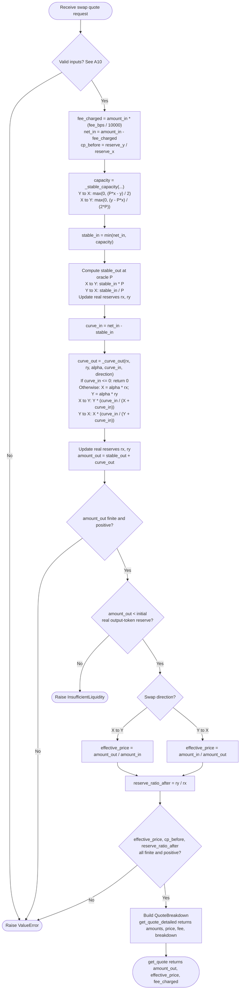

# Part 1 — Pricing Model Notes

[Back to project README](../README.md)

## Approach

The quote is computed in two phases, after deducting the input-token fee.
Let `x` and `y` be real reserves, `P` the oracle price in Y per X, and `q` the net input.

1. **Stable phase.** Rebalancing trades execute at `P` until `P*x = y`.
   For Y -> X, the stable input capacity is `max(0, (P*x - y)/2)` Y.
   For X -> Y, it is `max(0, (y - P*x)/(2*P))` X.
   Use the smaller of this capacity and `q`, then update the real reserves.
2. **Curve phase.** From the post-stable reserves `xs, ys`, set
   `vx = xs*(alpha - 1)` and `vy = ys*(alpha - 1)`. Hold these virtual reserves
   fixed during this phase. With `X = xs + vx`, `Y = ys + vy`, and remaining input `r`,
   the invariant is `(x + vx)*(y + vy) = L^2 = X*Y`.
   X -> Y returns `Y*r/(X+r)`; Y -> X returns `X*r/(Y+r)`.
3. **Return.** Sum the two outputs and reject trades that exhaust the real output
   reserve. Effective price uses gross input: `amount_out/amount_in` for X -> Y,
   and `amount_in/amount_out` for Y -> X. Both are expressed in Y per X.

At the start of a quote, `cpPrice = (alpha*y)/(alpha*x) = y/x`.
The pool's pre-fee marginal prices are `bid = min(P, cpPrice)` and
`ask = max(P, cpPrice)`. Alpha changes curve depth and finite-trade slippage,
but not the starting marginal price. A balanced pool has zero marginal spread;
a finite trade still incurs slippage.

`get_quote_detailed` additionally exposes phase inputs/outputs, `cp_price_before`,
and `reserve_ratio_after`. The last field is the final **real** Y/X reserve ratio,
excluding fees. It differs from the endpoint price `(y_after+vy)/(x_after+vx)`
of the curve used for this trade.

## Quote flow

The diagram follows `get_quote_detailed`, which `get_quote` calls internally.
Stable-only, curve-only, and mixed trades all use the same sequence: `min()`
allocates the stable input, and `_curve_out` returns zero for zero curve input.
All reserve updates use net input; fees are accounted for separately.



`effective_price` uses gross input and is always in Y per X. The liquidity
check uses the initial **real** output reserve, excluding virtual liquidity.
Reserve updates in this diagram describe the quote calculation; the function
does not execute a swap or persist pool state.

## Assumptions

- **A1:** 50/50 means equal oracle value (`P*x = y`), not equal token quantities.
- **A2:** Only trades improving that balance receive stable-phase execution at `P`.
- **A3:** Virtual reserves are built after the stable phase. A trade crossing the
  boundary therefore enters the curve at `P`, with continuous marginal pricing.
  The assignment does not specify this transition; this is an explicit modeling choice.
- **A4:** Fees are deducted once from the input token; only net input is priced.
- **A5:** Effective price includes fees and always uses Y per X.
- **A6:** Virtual reserves cannot be transferred. Quotes reaching or exceeding the
  real output reserve raise `InsufficientLiquidity`; partial fills are not modeled.
- **A7:** Bid/ask are pre-fee marginal prices; the requested signature has no fee argument.
- **A8:** The official cases omit `fee_bps`, so the canonical table uses zero fees.
  A separate 5 bps table illustrates fee handling.
- **A9:** Fees are accounted for separately from pricing reserves. This is a stateless
  quote model: each call rebuilds virtual reserves from its supplied state and does
  not persist one invariant across trades. Splitting a trade can therefore change total
  output. Under the same fee, fixed `P` and `alpha`, same direction, reserves updated by
  the net (post-fee) input after each fill, and both executions fillable, splitting never
  increases total output (ignoring floating-point rounding). Total output is strictly
  lower only when `alpha > 1` and at least two sub-trades each carry positive curve
  input; otherwise it is identical. For example, Case E (20,000 USDT) split as
  12,620 + 7,380 or 10,000 + 10,000 returns the same 30.678809 WBNB as the single trade,
  because the curve portion still executes in one piece, while 15,000 + 5,000 returns
  30.669075 WBNB. Case A split into 2 x 250 USDT yields about 6.14e-5 WBNB less than a
  single 500 USDT trade. This is covered by a regression test.
- **A10:** All numeric inputs must be finite. Reserves, `P`, and input amount must
  be positive; `alpha >= 1`; `0 <= fee_bps < 10000`; direction must be a boolean.
  Values use human token units and Python floats. Token decimals, integer rounding,
  and exact arithmetic at extreme numeric scales are outside this exercise's scope.

## Test results

See [results.md](results.md) for the generated A-D tables, the 5 bps
examples, and case E: 20,000 USDT against case C reserves, split into 12,620 USDT
stable input and 7,380 USDT curve input.

Two observations from the tables are worth calling out:

- **Case B is extreme by construction.** The Y-heavy pool has `cpPrice = 75,000 / 80 = 937.5`
  against an oracle of 627, so a 500 USDT buy fills at ~943.6, roughly 50% above market.
  This is what the literal specification produces, not a bug. In production it argues for
  safeguards outside the pricing function itself: an oracle deviation bound on `cpPrice`,
  quoting suspension when the pool is this imbalanced, or operator-driven pool inventory
  rebalancing (moving tokens into or out of the on-chain pool) to keep reserves near 50/50.
  Note that CEX delta hedging on Binance is a separate function: it changes the operator's
  net exposure but does not change `reserve_x` or `reserve_y`, so it cannot fix `cpPrice`.
- **Alpha has a small effect at this trade size.** Cases A and D differ only in `alpha`
  (1.02 vs 1.05). Relative to `alpha = 1`, the effective reserves are 2% and 5% deeper;
  relative to each other, D is `1.05 / 1.02 - 1 = 2.94%` deeper than A. For a 500 USDT
  trade against a Y-side reserve of 62,700 USDT, this raises output by 0.000175 WBNB and
  lowers slippage versus `P` from 78.18 bps (A) to 75.95 bps (D).

[test_pricing.py](test_pricing.py) checks the official numerical
results, input rejection (including NaN, infinity, and 100% fees), fee accounting,
both trade directions, curve invariants, marginal price limits, continuity at the
stable/curve boundary, diagnostic reserve ratios, and real-reserve exhaustion.
The curve tests cover `alpha = 1`, `1.02`, and `1.05`, with zero and nonzero fees.

From the repository root, regenerate the example output as UTF-8:

```
python -c "from pathlib import Path; from part1_pricing.pricing import main; Path('part1_pricing/results.md').write_text(main(), encoding='utf-8')"
```
