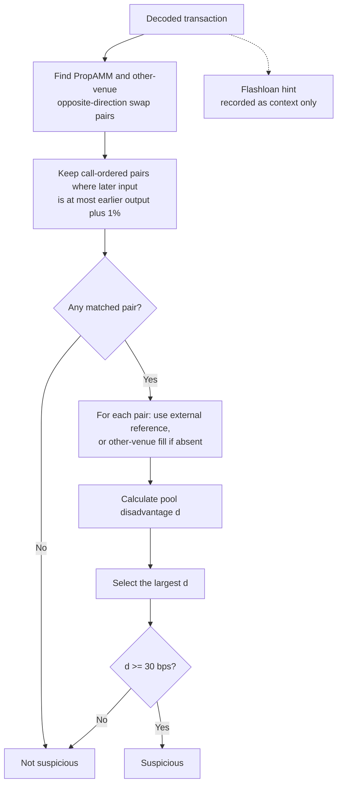
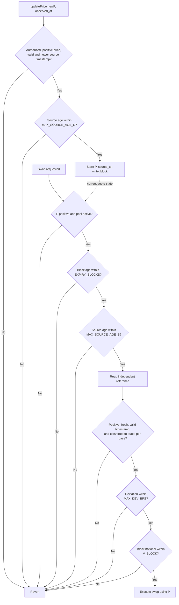

# Part 3 - Flashloan Arb Detection & Defence

[Project README](../README.md) / [Implementation](arb_detection.py) / [Tests](test_arb_detection.py)

## 1. Diagnose

Using a Lista DAO flashloan, the trader bought 0.01702 WBNB for 10 USDT on the
PropAMM and sold it for 10.627 USDT on PancakeSwap V2.

| Metric | Calculation | Result |
|---|---|---|
| PropAMM fill | 10 / 0.01702 | 587.54 USDT/WBNB |
| PancakeSwap fill | 10.627 / 0.01702 | 624.38 USDT/WBNB |
| Gross profit | 10.627 - 10 | 0.627 USDT, before loan fee and gas |

The oracle was about 6% below market. The [Part 1 model](../part1_pricing/MODEL.md)
only guarantees prices relative to that oracle:

```math
\mathrm{bid} \le P \le \mathrm{ask}.
```

With a stale $P$, the pool's ask can remain below the external market, allowing an
immediate resale profit. The enabling condition was accepting that price without an
effective freshness or independent deviation guard.

Flashloan funding makes the route atomic without upfront capital; a funded trader can
exploit the same gap. Curve slippage and real inventory limit the profitable size.
The stale duration and reserves are unknown.

### Exposure scale

For quote-to-base ($Y\to X$), stale-price exposure can span both phases. Stable
capacity and its no-fee loss at external price $R$ are:

```math
c=\max\left(0,\frac{Px-y}{2}\right),
\qquad \pi_s=c\left(\frac{R}{P}-1\right).
```

Only an X-heavy pool ($Px>y$) has positive $c$, so Stable capacity is not a general
attack bound. For effective Curve reserves $X,Y$ and net quote input $q$:

```math
\pi_c(q)=R\frac{Xq}{Y+q}-q,
\qquad q^*=\max\left(0,\sqrt{RXY}-Y\right),
\qquad \pi_c(q^*)=\left[\max\left(0,\sqrt{RX}-\sqrt{Y}\right)\right]^2.
```

At a balanced curve, $Y/X=P$, hence $q^*/Y=\sqrt{R/P}-1\approx3.1\%$ for
$R/P=624/587$. As an illustration, $x=100$ WBNB, $y=58{,}700$ USDT and
$\alpha=1.02$ give $q^*=1{,}858.17$ USDT and maximum gross profit $57.67$ USDT
before fees: the observed $0.627$ is about $1/92$ of that maximum. These are not the
observed reserves; fees and real-reserve limits reduce the result.

## 2. Detect

### Input contract

`is_suspicious_trade(tx_data)` consumes decoded events from one transaction.
The decoder supplies consistent token identifiers, normalized human token amounts,
and finite positive amounts and prices.

| Field | Contents |
|---|---|
| `swaps` | `{protocol, token_in, token_out, amount_in, amount_out}` records in call order |
| `transfers` | Optional `{token, from, to, amount}` records in log order |
| `interactions` | Optional protocol labels in call order |
| `caller` | Account calling the PropAMM; used to match loan transfers |
| `base_token`, `quote_token` | Default WBNB/USDT; set WETH/USDC for Base |
| `reference_price` | Optional independent price in quote per base, aligned to the transaction time |
| `timestamp`, `block_number` | Metadata for reference alignment; not used by the current classifier |

### Decision rule



Either venue may come first, and unspent output is allowed. Every matched pair is
evaluated so an earlier benign pair cannot hide a later attack.

For PropAMM fill price $p$ and reference $R$, both in quote per base:

```math
d = 10^4 \begin{cases}
\dfrac{R-p}{R}, & \text{pool sells base}, \\
\dfrac{p-R}{R}, & \text{pool buys base}.
\end{cases}
```

The observed trade gives **584.2 bps** at $R=624$. The 30 bps threshold is an
illustrative alert setting, separate from the assignment's 5 bps spread; calibrate
it against normal fills and reference error.

**Flashloan hint.** The first and last labels must name the same known lender, with
an intervening call. Alternatively, the first and last transfers must show a loan
to `caller` and repayment of at least that amount to the same counterparty and token.
These are heuristics, not proof of a flashloan; extra outer transfers can hide the bracket.

**Limits.** Without `reference_price`, the other venue's fill is used, so the detector
cannot identify which venue was stale. Amount matching does not prove common ownership
or trace funding through routers; partial matches can join unrelated legs. This is an
alert for two-leg patterns, not a complete detector for multi-hop or cross-transaction arb.

### Coverage beyond one transaction

Keep `is_suspicious_trade` scoped to the transaction interface in the assignment.
A companion monitor compares every PropAMM fill with a block-aligned reference and
aggregates pool-wide adverse loss over a rolling block window $W$:

```math
L_W=\sum_{i\in W}\max(0,d_i)\frac{\mathrm{notional}_i}{10^4}.
```

Alert or pause when a single fill exceeds 30 bps, $L_W$ exceeds its USD risk budget,
or same-direction base outflow exceeds its inventory limit. Pool-wide aggregation
prevents address rotation from hiding cross-transaction, slow, or multi-hop extraction.

`analyse_trade()` returns the selected pair's prices, disadvantage, gross P&L,
candidate count, and reasons. Gross P&L values leftover base at the reference; it
excludes loan fees and gas and is not the whole transaction's profit.

## 3. Defend

Reject swaps when the quote is expired, its source observation is too old, or its
price deviates from an independent reference. The updater must preserve the source
timestamp when resending an observation.



`EXPIRY_BLOCKS` and `MAX_SOURCE_AGE_S` come from Section 4. `MAX_DEV_BPS = 50`
is illustrative. With all prices on one fixed-point scale, the integer check is
`abs(P - ref) * 10_000 <= MAX_DEV_BPS * ref`.

| Control | Configuration | On failure |
|---|---|---|
| Primary price | Binance-derived price from the authorized updater; preserve `observed_at` | Reject update |
| Source age / block expiry | Section 4: 5 s / 6 blocks on BSC; 8 s / 4 blocks on Base for every-block refresh | Revert swap |
| Independent reference | BNB/USD divided by USDT/USD on BSC; ETH/USD divided by USDC/USD on Base | Revert swap |
| Reference age | Each deployed feed's published heartbeat plus two blocks; reject future timestamps | Revert swap |
| Price deviation | `MAX_DEV_BPS = 50` initially; calibrate from reference error and normal basis | Revert swap |
| Block notional | `V_BLOCK` derived from the loss budget below | Revert excess swap |
| Automatic fallback | None; a DEX TWAP requires separate manipulation and lag limits before use | Pause and alert |

As defence in depth, cap aggregate quote notional per block by a loss budget:

```math
V_{\mathrm{block}}\le
\frac{L_{\mathrm{block}}}{(\mathrm{MAX\_DEV\_BPS}+e_{\mathrm{ref}})/10^4},
```

where $L_{\mathrm{block}}$ is tolerated USD loss and $e_{\mathrm{ref}}$ is the
reference error budget in bps. Both are deployment risk parameters; the assignment
does not provide values from which to set them.

Validate every constituent feed's `updatedAt`: Chainlink feeds update on heartbeat or
deviation triggers, so read time does not prove freshness.
[Reference validation](https://docs.chain.link/data-feeds#check-the-timestamp-of-the-latest-answer).

**Effect.** A reference close to market rejects the observed 6% gap at a 50 bps
limit. This bounds deviation from the reference, not total loss or deviation from
the live market if the reference lags. Reference lag can also halt valid quotes.

**Operation.** The bot checks the same conditions before publishing and alerts on
failure. Source timestamps are trusted assertions by the authorized updater. If the
feed stops, stop publishing and let expiry halt swaps; resume only with fresh,
validated data. Use a separate deployment for tests. Caller or lender blocklists
do not protect against traders using their own funds.

## 4. Threshold: price expiry

Use **6 BSC blocks and 4 Base blocks if refreshing every block**, under the latency
budget below. A slower refresh schedule requires recalculation.

| Symbol | Budget | Unit |
|---|---|---|
| $b$ | Block time: BSC 0.75, Base 2, as given in the assignment | Seconds |
| $T_r$ | Scheduled refresh interval; latest available observation selected at submission | Seconds |
| $T_s$ | Expected WebSocket silence: 2 | Seconds |
| $T_i$ | Inclusion allowance: one block | Seconds |
| $T_m$ | Scheduling and RPC margin: one block | Seconds |
| $N$ | Maximum permitted block age (`EXPIRY_BLOCKS`) | Blocks |
| $A$ | Maximum source age (`MAX_SOURCE_AGE_S`), rounded to whole seconds | Seconds |

Budget the refresh wait, feed silence, inclusion, and margin separately:

```math
N = \left\lceil \frac{T_r + T_s + T_i + T_m}{b} \right\rceil,
\qquad A = \left\lceil Nb \right\rceil.
```

For every-block refresh, $T_r=T_i=T_m=b$:

```math
\begin{aligned}
N_{\mathrm{BSC}} &= \left\lceil \frac{0.75+2+0.75+0.75}{0.75} \right\rceil = 6, \\
N_{\mathrm{Base}} &= \left\lceil \frac{2+2+2+2}{2} \right\rceil = 4.
\end{aligned}
```

| Refresh schedule | BSC: $N$ / $A$ | Base: $N$ / $A$ |
|---|---|---|
| Every block | **6 blocks / 5 s** | **4 blocks / 8 s** |
| Every 13 BSC blocks / 5 Base blocks | **18 blocks / 14 s** | **8 blocks / 16 s** |

The second row illustrates the cadence inferred from the assignment's cost figures:

```math
T_{\mathrm{avg}} = \frac{86400 \times 0.50}{7.2 \times 627}
\approx 9.57\ \mathrm{s}.
```

Here 0.50 is USD per refresh and $7.2\times627$ is USD per day. Rounding the average
up to scheduled blocks gives $T_r=9.75$ s on BSC and $T_r=10$ s on Base. The resulting
expiry is $\lceil(9.75+2+0.75+0.75)/0.75\rceil=18$ and
$\lceil(10+2+2+2)/2\rceil=8$ blocks. The contradictory parenthetical gas estimate in
the assignment is ignored in favor of the stated 0.50 USD per refresh.

These are planning budgets, not measured worst cases. Validate refresh and inclusion
delays before deployment; average spend alone does not establish a safe expiry.
The checks allow age equal to the limit and reject greater ages. Source age remains
independent of block age, so resubmission or slower blocks cannot keep old data alive.

**The 2-second silence is expected data ageing.** It fits the budget but does not
guarantee price accuracy. Longer gaps eventually expire the quote; moves within the
window rely on the reference check, subject to its own lag. The attack's stale duration
is unknown, so expiry alone cannot be claimed to have prevented it.
