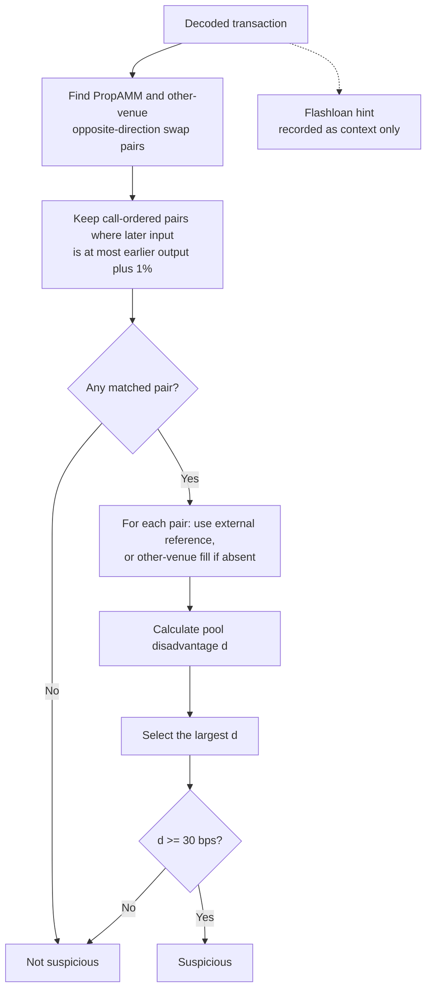
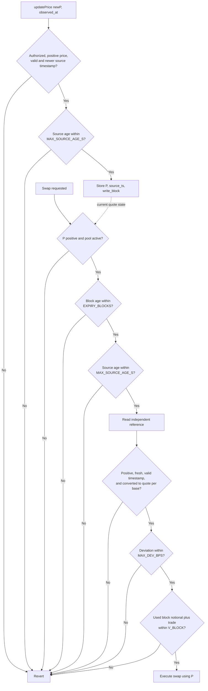

# Part 3 - Flashloan Arb Detection & Defence

[Project README](../README.md) / [Implementation](arb_detection.py) / [Tests](test_arb_detection.py)

## 1. Diagnose

Using a Lista DAO flashloan, the trader bought 0.01702 WBNB for 10 USDT on the
PropAMM and sold it for 10.627 USDT on PancakeSwap V2.

| Metric | Calculation | Result |
|---|---|---|
| PropAMM fill | 10 / 0.01702 | 587.54 USDT/WBNB |
| PancakeSwap fill | 10.627 / 0.01702 | 624.38 USDT/WBNB |
| Gross profit | 10.627 - 10 | 0.627 USDT, before loan fee and gas |

The oracle was about 6% below market. The [Part 1 model](../part1_pricing/MODEL.md)
only guarantees prices relative to that oracle:

```math
\mathrm{bid} \le P \le \mathrm{ask}.
```

With a stale $P$, the pool's ask can remain below the external market, allowing an
immediate resale profit. The enabling condition was accepting that price without an
effective freshness or independent deviation guard.

Flashloan funding makes the route atomic without upfront capital; a funded trader can
exploit the same gap. Curve slippage and real inventory limit the profitable size.
The stale duration and reserves are unknown.

## Exposure scale (supplement)

| Symbol | Meaning | Unit |
|---|---|---|
| $x,y$ | Real base and quote reserves before Stable | Base token, quote token |
| $X,Y$ | Effective base and quote reserves at the start of Curve | Base token, quote token |
| $\alpha$ | Concentration factor used to form effective reserves | Dimensionless |
| $P,R$ | PropAMM oracle price and external market price | Quote per base |
| $c$ | Stable quote-input capacity | Quote token |
| $q,q^*$ | Net Curve quote input and profit-maximizing input | Quote token |
| $\pi_s,\pi_c$ | No-fee trader gross profit, equal to pool mark-to-market loss | Quote token |

For a quote-to-base (Y to X) trade, stale-price exposure can span both phases.
Stable capacity and its no-fee loss are:

```math
\begin{aligned}
c &= \max\left(0,\frac{Px-y}{2}\right), \\
\pi_s &= c\left(\frac{R}{P}-1\right).
\end{aligned}
```

Stable capacity is positive only when `Px > y`, so it is not a general attack bound.
Curve profit, its maximizing input, and the resulting maximum are:

```math
\begin{aligned}
\pi_c(q) &= R\frac{Xq}{Y+q}-q,
&& \text{profit function}, \\
q^* &= \max\left(0,\sqrt{RXY}-Y\right),
&& \text{optimal input}, \\
\pi_c(q^*) &= \left[\max\left(0,\sqrt{RX}-\sqrt{Y}\right)\right]^2,
&& \text{maximum profit}.
\end{aligned}
```

At a balanced Curve, the reserve ratio equals the oracle price. Because the external
price exceeds the oracle price in this attack, the positive branch applies. Divide by
the effective quote reserve and substitute the balance condition:

```math
\frac{q^*}{Y}
=\frac{\sqrt{RXY}-Y}{Y}
=\sqrt{\frac{RXY}{Y^2}}-1
=\sqrt{\frac{RX}{Y}}-1
=\sqrt{\frac{R}{Y/X}}-1
=\sqrt{\frac{R}{P}}-1.
```

For the observed price ratio:

```math
\frac{q^*}{Y}
=\sqrt{\frac{624}{587}}-1
\approx 3.10\%.
```

Illustrative case, not observed reserves: 100 WBNB and 58,700 USDT, alpha 1.02,
oracle 587, market 624, and zero fees give an optimal net input of 1,858.17 USDT
and maximum gross profit of 57.67 USDT. The observed 0.627 USDT is about 1/92 of
that maximum. Fees and real-reserve limits reduce the result.

## 2. Detect

### Input contract

`is_suspicious_trade(tx_data)` consumes decoded events from one transaction.
The decoder supplies consistent token identifiers, normalized human token amounts,
and finite positive amounts and prices.

| Field | Contents |
|---|---|
| `swaps` | `{protocol, token_in, token_out, amount_in, amount_out}` records in call order |
| `transfers` | Optional `{token, from, to, amount}` records in log order |
| `interactions` | Optional protocol labels in call order |
| `caller` | Account calling the PropAMM; used to match loan transfers |
| `base_token`, `quote_token` | Default WBNB/USDT; set WETH/USDC for Base |
| `reference_price` | Optional independent price in quote per base, aligned to the transaction time |
| `timestamp`, `block_number` | Metadata for reference alignment; not used by the current classifier |

### Decision rule



Either venue may come first, and unspent output is allowed. Every matched pair is
evaluated so an earlier benign pair cannot hide a later attack.

For PropAMM fill price $p$ and reference $R$, both in quote per base:

```math
d = 10^4 \begin{cases}
\dfrac{R-p}{R}, & \text{pool sells base}, \\
\dfrac{p-R}{R}, & \text{pool buys base}.
\end{cases}
```

The observed trade gives **584.2 bps** at $R=624$. The 30 bps threshold is an
illustrative alert setting, separate from the assignment's 5 bps spread; calibrate
it against normal fills and reference error.

**Flashloan hint.** The first and last labels must name the same known lender, with
an intervening call. Alternatively, the first and last transfers must show a loan
to `caller` and repayment of at least that amount to the same counterparty and token.
These are heuristics, not proof of a flashloan; extra outer transfers can hide the bracket.

**Limits.** Without `reference_price`, the other venue's fill is used, so the detector
cannot identify which venue was stale. Amount matching does not prove common ownership
or trace funding through routers; partial matches can join unrelated legs. This is an
alert for two-leg patterns, not a complete detector for multi-hop or cross-transaction arb.

### Coverage beyond one transaction

Keep `is_suspicious_trade` scoped to the transaction interface in the assignment.
A companion monitor compares every PropAMM fill with a block-aligned reference and
aggregates pool-wide adverse loss over a rolling block window $W$:

```math
L_W=\sum_{i\in W}\max(0,d_i)\frac{\mathrm{notional}_i}{10^4}.
```

Alert or pause when a single fill exceeds 30 bps, $L_W$ exceeds its USD risk budget,
or same-direction base outflow exceeds its inventory limit. Pool-wide aggregation
prevents address rotation from hiding cross-transaction, slow, or multi-hop extraction.

`analyse_trade()` returns the selected pair's prices, disadvantage, gross P&L,
candidate count, and reasons. Gross P&L values leftover base at the reference; it
excludes loan fees and gas and is not the whole transaction's profit.

## 3. Defend

Reject swaps when the quote is expired, its source observation is too old, or its
price deviates from an independent reference. The updater must preserve the source
timestamp when resending an observation.

### Notation and constants

| Symbol | Pseudocode name | Meaning | Unit / initial setting |
|---|---|---|---|
| $P$ | `P` | Binance-derived primary price stored with its source timestamp | Quote per base |
| $R$ | `ref` | Validated cross-rate: BNB/USD ÷ USDT/USD on BSC; ETH/USD ÷ USDC/USD on Base | Quote per base |
| $t_{\mathrm{src}}$ | `source_ts` | Timestamp of the source observation behind $P$ | Unix seconds |
| $b_{\mathrm{write}}$ | `write_block` | Block in which $P$ was stored | Block number |
| $N$ | `EXPIRY_BLOCKS` | Maximum age since `write_block` | 6 BSC blocks / 4 Base blocks at every-block refresh |
| $A$ | `MAX_SOURCE_AGE_S` | Maximum age since `source_ts` | 5 s on BSC / 8 s on Base at every-block refresh |
| $H_{\mathrm{ref}}$ | `REF_MAX_AGE_S` | Maximum age of each reference feed | Published heartbeat plus two blocks |
| $D_{\max}$ | `MAX_DEV_BPS` | Maximum deviation between $P$ and $R$ | 50 bps initially |
| $V_{\mathrm{block}}$ | `V_BLOCK` | Maximum aggregate quote notional accepted per block | USD-equivalent quote token; derived below |
| $L_{\mathrm{block}}$ | `L_BLOCK` | Tolerated mark-to-market loss per block | USD; deployment parameter |
| $e_{\mathrm{ref}}$ | `REF_ERROR_BPS` | Reference error allowance | Bps; deployment parameter |

### Guard flow



`EXPIRY_BLOCKS` and `MAX_SOURCE_AGE_S` come from Section 4. With all prices on one
fixed-point scale, the integer deviation check is
`abs(P - ref) * 10_000 <= MAX_DEV_BPS * ref`.

Every failed guard reverts. If either price source is unavailable, the bot pauses and
alerts; there is no automatic fallback. A DEX TWAP requires separate manipulation and
lag limits before it can be enabled.

### Per-block loss limit

As defence in depth, cap aggregate quote notional per block by a loss budget:

```math
V_{\mathrm{block}}\le
\frac{L_{\mathrm{block}}}{(D_{\max}+e_{\mathrm{ref}})/10^4}.
```

Here $V_{\mathrm{block}}$ and `V_BLOCK` are the same limit. Before execution, the
contract checks `block_notional[block.number] + trade_notional <= V_BLOCK`. The loss
and reference-error budgets are deployment parameters; the assignment does not provide
values from which to set them.

Validate every constituent feed's `updatedAt`: Chainlink feeds update on heartbeat or
deviation triggers, so read time does not prove freshness.
[Reference validation](https://docs.chain.link/data-feeds#check-the-timestamp-of-the-latest-answer).

**Effect.** A reference close to market rejects the observed 6% gap at a 50 bps
limit. This bounds deviation from the reference, not total loss or deviation from
the live market if the reference lags. Reference lag can also halt valid quotes.

**Operation.** The bot checks the same conditions before publishing and alerts on
failure. Source timestamps are trusted assertions by the authorized updater. If the
feed stops, stop publishing and let expiry halt swaps; resume only with fresh,
validated data. Use a separate deployment for tests. Caller or lender blocklists
do not protect against traders using their own funds.

## 4. Threshold: price expiry

Use **6 BSC blocks and 4 Base blocks** for the every-block baseline. If refreshes
instead follow the 9.57-second cadence inferred from current spend, use **18 BSC
blocks and 8 Base blocks**. Select the scenario that matches the deployed cadence.

The expiry covers four sources of delay: the scheduled refresh wait, the expected
2-second WebSocket silence, transaction inclusion, and an RPC/scheduling margin.

| Symbol | Budget | Unit |
|---|---|---|
| $b$ | Block time: BSC 0.75, Base 2, as given in the assignment | Seconds |
| $T_r$ | Scheduled refresh interval; latest available observation selected at submission | Seconds |
| $T_s$ | Expected WebSocket silence: 2 | Seconds |
| $T_i$ | Inclusion allowance: one block | Seconds |
| $T_m$ | Scheduling and RPC margin: one block | Seconds |
| $N$ | Maximum permitted block age (`EXPIRY_BLOCKS`) | Blocks |
| $A$ | Maximum source age (`MAX_SOURCE_AGE_S`), rounded to whole seconds | Seconds |
| $n_{\mathrm{day}}$ | Refresh count implied by daily spend | Refreshes per day |
| $T_{\mathrm{avg}}$ | Average refresh interval implied by daily spend | Seconds |

Budget the refresh wait, feed silence, inclusion, and margin separately:

```math
N = \left\lceil \frac{T_r + T_s + T_i + T_m}{b} \right\rceil,
\qquad A = \left\lceil Nb \right\rceil.
```

The contract accepts ages equal to the limits and rejects greater ages.

### Scenario 1 — Every-block refresh baseline

This is the most aggressive refresh baseline. Set the refresh, inclusion, and margin
allowances to one block each:

```math
T_r=T_i=T_m=b.
```

```math
\begin{aligned}
N_{\mathrm{BSC}}
&=\left\lceil\frac{0.75+2+0.75+0.75}{0.75}\right\rceil=6,
&\qquad A_{\mathrm{BSC}}&=\left\lceil6\times0.75\right\rceil=5\ \mathrm{s}, \\
N_{\mathrm{Base}}
&=\left\lceil\frac{2+2+2+2}{2}\right\rceil=4,
&\qquad A_{\mathrm{Base}}&=\left\lceil4\times2\right\rceil=8\ \mathrm{s}.
\end{aligned}
```

| Chain | Refresh interval $T_r$ | Block expiry $N$ | Source-age limit $A$ |
|---|---:|---:|---:|
| BSC | 1 block = 0.75 s | **6 blocks = 4.5 s** | **5 s** |
| Base | 1 block = 2 s | **4 blocks = 8 s** | **8 s** |

### Scenario 2 — Cost-aligned refresh cadence

The stated spend is 7.2 BNB/day per chain. Using 627 USD/BNB and 0.50 USD per
refresh gives:

```math
\begin{aligned}
n_{\mathrm{day}}
&=\frac{7.2\times627}{0.50}=9{,}028.8, \\
T_{\mathrm{avg}}
&=\frac{86{,}400}{n_{\mathrm{day}}}\approx9.57\ \mathrm{s}.
\end{aligned}
```

Round the cadence up to whole blocks before recomputing expiry:

```math
\begin{aligned}
T_{r,\mathrm{BSC}}
&=\left\lceil\frac{9.57}{0.75}\right\rceil(0.75)
=13\ \text{blocks}=9.75\ \mathrm{s}, \\
T_{r,\mathrm{Base}}
&=\left\lceil\frac{9.57}{2}\right\rceil(2)
=5\ \text{blocks}=10\ \mathrm{s}.
\end{aligned}
```

```math
\begin{aligned}
N_{\mathrm{BSC}}
&=\left\lceil\frac{9.75+2+0.75+0.75}{0.75}\right\rceil=18,
&\qquad A_{\mathrm{BSC}}&=\left\lceil18\times0.75\right\rceil=14\ \mathrm{s}, \\
N_{\mathrm{Base}}
&=\left\lceil\frac{10+2+2+2}{2}\right\rceil=8,
&\qquad A_{\mathrm{Base}}&=\left\lceil8\times2\right\rceil=16\ \mathrm{s}.
\end{aligned}
```

| Chain | Rounded refresh interval $T_r$ | Block expiry $N$ | Source-age limit $A$ |
|---|---:|---:|---:|
| BSC | 13 blocks = 9.75 s | **18 blocks = 13.5 s** | **14 s** |
| Base | 5 blocks = 10 s | **8 blocks = 16 s** | **16 s** |

The assignment's parenthetical gas estimate conflicts with 0.50 USD per refresh;
the calculation uses the explicit 0.50 USD figure.

These are planning budgets, not measured worst cases. Validate refresh and inclusion
delays before deployment; average spend alone does not establish a safe expiry.
Source age remains independent of block age, so resubmission or slower blocks cannot
keep old data alive.

**WebSocket silence.** Treat the expected 2-second silence as staleness exposure and
include it in the budget, but do not halt immediately. A longer gap eventually expires
the quote; price moves within the window rely on the independent deviation check. The
attack's stale duration is unknown, so expiry alone cannot be claimed to have stopped it.
